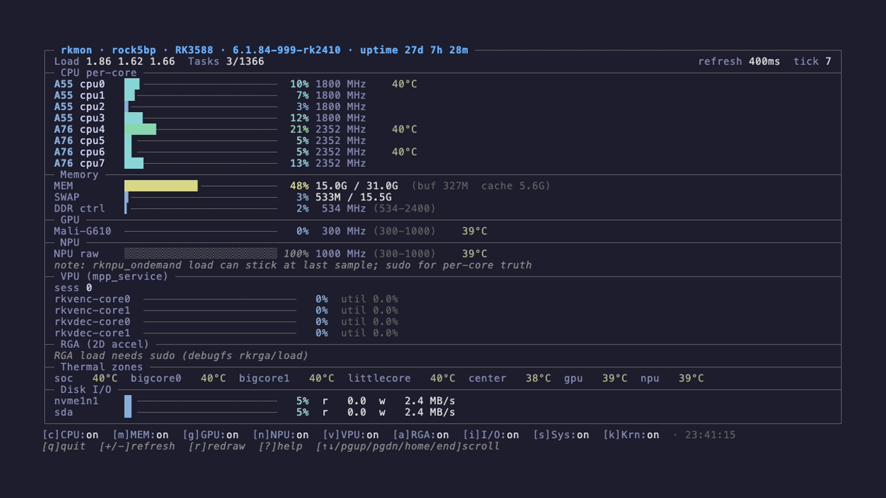

<div align="center">

# rkmon

**Real-time hardware monitor TUI for Rockchip RK3588 SBCs.**

Like `htop`, but for the **GPU, NPU, VPU, RGA, DDR controller, and thermal zones** of your Radxa Rock 5B+, Orange Pi 5, or any RK3588 board.

[](https://github.com/isac322/rkmon/releases/latest)
[](https://github.com/isac322/rkmon/actions/workflows/ci.yml)
[](https://go.dev/)
[](LICENSE)
[](https://github.com/isac322/rkmon/releases/latest)



</div>

---

## Why rkmon

The RK3588 is one of the most capable ARM SoCs ever shipped to hobbyists: an 8‑core CPU (4× A76 + 4× A55), a Mali‑G610 MP4 GPU, a 6 TOPS 3‑core NPU, dedicated video encode/decode IP, and a 2D acceleration block. **General‑purpose monitors don't see any of that.** `htop` shows CPU and memory. `btop` adds a generic GPU bar. Neither can answer "is the VPU actually used?" or "is the NPU stuck at 100% idle?" or "is DDR controller load my real bottleneck?"

`rkmon` is purpose‑built for RK3588‑class boards. It reads the kernel's actual devfreq, mpp_service, rknpu, rkrga, and thermal_zone interfaces — the same nodes the Rockchip BSP uses internally — and renders them at sub‑two‑percent CPU usage at 1 Hz refresh.

## Features

- **Full RK3588 accelerator coverage**: per‑core CPU + Mali‑G610 GPU + RKNPU (per‑core when root) + Rockchip VPU (`mpp_service`) + RGA 2D engine + DDR controller + 7 thermal zones.
- **Sub‑2% CPU** at 1 Hz refresh on the rock5bp itself. Static aarch64 binary, **no Go runtime overhead on startup**, no Python, no Node, no dependencies.
- **Responsive layout**: collapses to 60 cols, expands to a two‑column wide layout at ≥150 cols. Body scrolls when content exceeds height; top/bottom border + footer stay pinned.
- **Per‑section toggles**: turn CPU/MEM/GPU/NPU/VPU/RGA panels on or off with a single keypress (`c`/`m`/`g`/`n`/`v`/`a`).
- **Optional tiers**: I/O (disks + network + thermal throttle), System (CMA, fan PWM, governor, PCIe links), and Kernel (context switches/sec, IRQ per‑CPU) — toggled with `i`/`s`/`k`, auto‑shown when the terminal is tall enough.
- **Multi‑tab help**: keybinds, metric provenance (every sysfs/proc path is documented), and copy‑paste stress‑test recipes (`yes`/`stress-ng`/`ffmpeg`/`glmark2`/`iperf3`) per metric.
- **One‑shot mode** (`--once`) writes a single snapshot to stdout — perfect for `cron`, dashboards, or shipping to Prometheus via a wrapper.
- **Cleanly handles non‑root**: stale NPU readings are flagged, sudo‑only metrics show a hint instead of lying.

## Install

### Pre-built binary (recommended)

```sh
# Download latest release for linux/arm64
curl -sSL https://github.com/isac322/rkmon/releases/latest/download/rkmon_0.2.0_linux_arm64.tar.gz \
  | tar -xz -C /tmp rkmon
sudo install -m 0755 /tmp/rkmon /usr/local/bin/rkmon
rkmon --version
```

Or grab the tarball directly from the [latest release](https://github.com/isac322/rkmon/releases/latest) and verify with `checksums.txt`.

### From source

```sh
git clone https://github.com/isac322/rkmon.git
cd rkmon
make build               # cross‑compiles to build/rkmon (linux/arm64, static)
make deploy              # scp + install to ~/.local/bin/rkmon on $TARGET
```

Build requirements: Go 1.24+. No CGO.

## Usage

```sh
rkmon                    # 1s refresh, height-aware tier auto-show
rkmon --refresh=500ms    # faster refresh
rkmon --tiers=all        # force every panel on
rkmon --tiers=i,k        # I/O + Kernel tiers only
rkmon --once             # one snapshot to stdout, then exit
rkmon --no-color         # plain output, layout preserved
sudo rkmon               # unlock NPU per-core, VPU load%, RGA load%
```

### Keybinds

| Key | Action |
| --- | --- |
| `q` `ctrl+c` `esc` | Quit |
| `+` `-` | Adjust refresh rate (±100 ms, clamped 200 ms–10 s) |
| `r` | Force redraw |
| `c` `m` `g` `n` `v` `a` | Toggle CPU / MEM / GPU / NPU / VPU / RGA panels |
| `i` `s` `k` | Toggle I/O / System / Kernel tiers (also `1` `2` `3`) |
| `?` | Open multi-tab help (keybinds, metrics, stress tests) |
| `↑` `↓` `j` | Scroll body one row |
| `pgup` `pgdn` `space` | Scroll body one page |
| `home` `end` | Jump to top / bottom |

## Comparison

| Feature                          | rkmon          | htop          | btop          | gotop         | nvtop          |
| -------------------------------- | -------------- | ------------- | ------------- | ------------- | -------------- |
| **CPU per‑core**                 | yes            | yes           | yes           | yes           | no             |
| **Memory + SWAP**                | yes            | yes           | yes           | yes           | no             |
| **Mali‑G610 GPU (RK3588)**       | yes            | no            | no            | no            | no             |
| **RKNPU 3‑core (RK3588)**        | yes            | no            | no            | no            | no             |
| **Rockchip VPU `mpp_service`**   | yes            | no            | no            | no            | no             |
| **RGA 2D accelerator**           | yes            | no            | no            | no            | no             |
| **DDR controller load**          | yes            | no            | no            | no            | no             |
| **All 7 RK3588 thermal zones**   | yes            | no            | partial       | no            | no             |
| **Devfreq‑driven frequencies**   | yes            | no            | no            | no            | partial        |
| **PCIe link speed/width**        | yes            | no            | no            | no            | no             |
| **Static aarch64 binary**        | yes (≈ 4 MB)   | n/a           | n/a           | n/a           | n/a            |
| **Sub‑2 % CPU at 1 Hz**          | yes            | yes           | varies        | yes           | yes            |

`htop`/`btop`/`gotop` are excellent general‑purpose monitors — `rkmon` is what you reach for the moment you actually care which accelerator on your RK3588 is doing the work.

## Hardware support

- **Designed for and tested on**: Radxa Rock 5B+ (RK3588), Debian 12, kernel 6.1.x rockchip BSP.
- **Should work on** any RK3588 / RK3588S board (Rock 5A/5B/5B+, Orange Pi 5/5B/5 Plus, NanoPi R6S/R6C, etc.) as long as the BSP exposes the standard sysfs nodes (`/sys/class/devfreq/{fb000000.gpu-mali,fdab0000.npu,dmc}`, `/sys/kernel/debug/{rknpu,rkrga}`, `/proc/mpp_service/`).
- **Other Rockchip SoCs** (RK3399, RK3568, etc.) are not actively tested; some panels will show "n/a" depending on which IP blocks the SoC has.
- **Host OS**: any glibc‑based Linux distribution on aarch64. `rkmon` does not run on macOS or x86.

## Metric coverage

Every panel reads from a public kernel interface. The full provenance is also available in‑app via the `?` → Metrics tab.

| Panel | Source | Root required? |
| --- | --- | --- |
| CPU per‑core | `/proc/stat` + `/sys/devices/system/cpu/cpu*/cpufreq/scaling_cur_freq` | no |
| Memory / SWAP | `/proc/meminfo` | no |
| GPU (Mali‑G610) | `/sys/class/devfreq/fb000000.gpu-mali/{load,cur_freq}` | no |
| NPU aggregate | `/sys/class/devfreq/fdab0000.npu/{load,cur_freq}` | no |
| **NPU per‑core** | `/sys/kernel/debug/rknpu/load` | **yes** |
| DDR controller | `/sys/class/devfreq/dmc/load` | no |
| VPU sessions | `/proc/mpp_service/sessions-summary` + `task_count` | no |
| **VPU load %** | `/proc/mpp_service/load` (sets `load_interval=1000` once) | **yes** |
| **RGA load %** | `/sys/kernel/debug/rkrga/load` | **yes** |
| Thermal zones | `/sys/class/thermal/thermal_zone*/{type,temp}` | no |
| Disk I/O | `/proc/diskstats` (whole disks only) | no |
| Network | `/proc/net/dev` (physical interfaces only) | no |
| Throttle | `/sys/class/thermal/cooling_device*/{type,cur_state,max_state}` | no |
| CMA pool | `/proc/meminfo` (`CmaTotal` / `CmaFree`) | no |
| Fan PWM / RPM | `/sys/class/hwmon/*/{pwm1,fan1_input}` | no |
| CPU governor | `/sys/devices/system/cpu/cpufreq/policy*/scaling_governor` | no |
| PCIe links | `/sys/bus/pci/devices/*/{current_link_speed,current_link_width,class}` | no |
| Ctx switches / IRQ | `/proc/stat` (`ctxt`) + `/proc/interrupts` | no |

## Performance

Measured on a Radxa Rock 5B+ (RK3588, 8 cores) running rkmon under tmux against itself:

| Refresh | CPU usage |
| ------- | --------- |
| 0.5 s   | ~3.0 %    |
| 1.0 s   | **~1.6 %** |
| 2.0 s   | ~1.0 %    |

Resident memory settles at 7–9 MB.

## Architecture

`rkmon` is a single static binary (~4 MB) built with [Bubble Tea](https://github.com/charmbracelet/bubbletea) + [Lipgloss](https://github.com/charmbracelet/lipgloss). The hot‑rendering path bypasses Lipgloss style allocation by precomputing raw ANSI prefixes — that's most of the 1.6 % CPU win.

```
cmd/rkmon/         CLI entry, flags, Bubble Tea program wiring
internal/collect/  Pure parsers (testable) + concrete sysfs/proc collector
internal/ui/       Layout, panels, scroll, styles, help tabs
```

Parser tests run against captured `/proc` and `/sys` fixtures from the actual rock5bp — no live host needed to iterate.

## Roadmap

- [ ] Native RK3588S support testing on Rock 5C / Orange Pi 5
- [ ] Per‑process VPU/NPU attribution (open question: kernel does not expose this today)
- [ ] Persistent log mode (`--log=csv`) for offline analysis
- [ ] Prometheus exporter wrapper script
- [ ] Color theme overrides

## Contributing

Issues and PRs welcome. Please include:

- Your board model + kernel version (`uname -r`)
- A `rkmon --once` snapshot for repro
- For new metric panels: the sysfs/proc path you want surfaced

Standard Go project layout. `make test vet lint` should pass before sending a PR.

## License

[MIT](LICENSE) © 2026 Byeonghoon Yoo

---

<div align="center">

**Built for RK3588.** **Designed for embedded Linux developers.** **Ships as one binary.**

</div>
